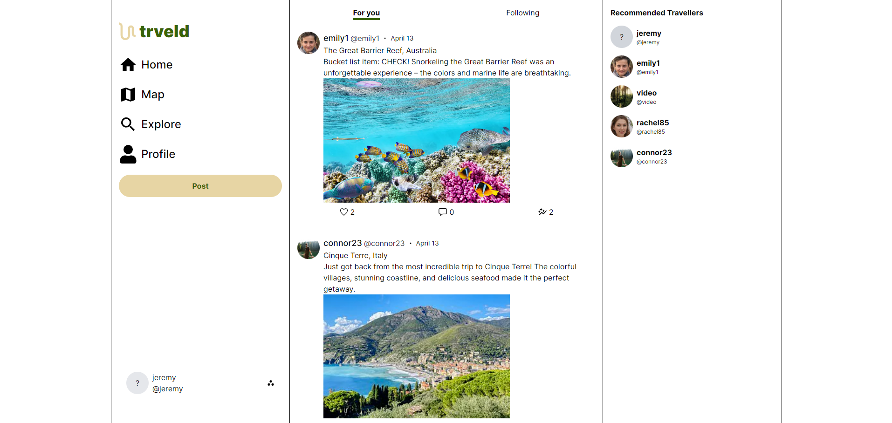

# Trveld

Trveld is a web application that I made for my capstone senior project while attending Utah Tech University for my Bachelors of Science in Software Engineering. The purpose of this application is to allow users to use an interactive map to mark off countries that they have visited and can upload all of their memories from that place in one central location. They can also post about their travels in the social feed so that other users can plan for their future travels based on your experiences. For the backend of this application I used Go with the Gin and GORM libraries to handle the http server/endpoints and to handle all database interactions. For the frontend of this application I used Next.js with TypeScript and tailwind css for styling. JWTs are used for authentication and authorization with bcrypt to hash the users password. All text based information is stored in a PostgreSQL database and all images are uploaded and hosted from an AWS S3 bucket.

